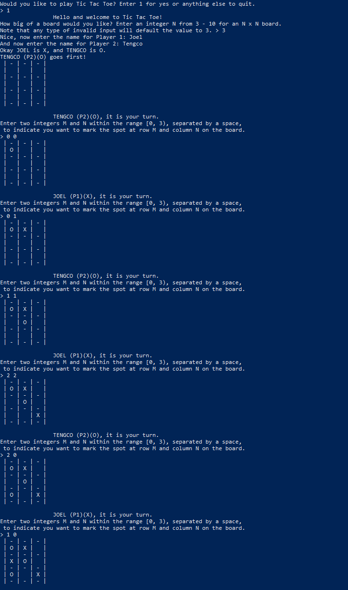
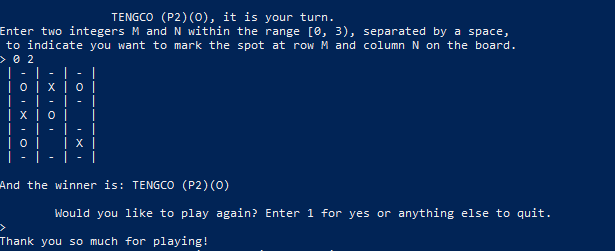

# game-tictactoe
Simple Tic Tac Toe game using the console as the interface for the two players.

#### Running the program
Once in the bin folder, one can run the program with, assuming Java is installed properly:

`java -classpath . edu.cpp.cs.cs141.prog_assgmnt_1.Main`

Here is an example of the program:

